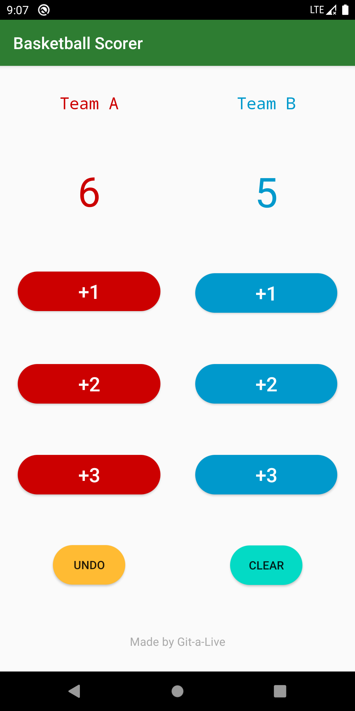

# Basketball Scorer

*A simple birthday gift to my friend who loves playing basketball*
****
## Preview

****

## Features

Basketball Scorer has four features: display, count, rollback, and clear scores.

**Display**: It shows the name of each team and their scores with different colors;

**Counter**: The most basic function of this application. Each team has three buttons to count scores. Of course, these buttons are corresponding to  1-pointer, 2-pointers and 3-pointers.

**Rollback**: If users made mistakes and count wrong scores, they can rollback to the scores of last time -- before the wrong score was entered and only once. 

**Clear**: After the basketball game, it has no need to store these scores any more, just set them to *ZERO*.
